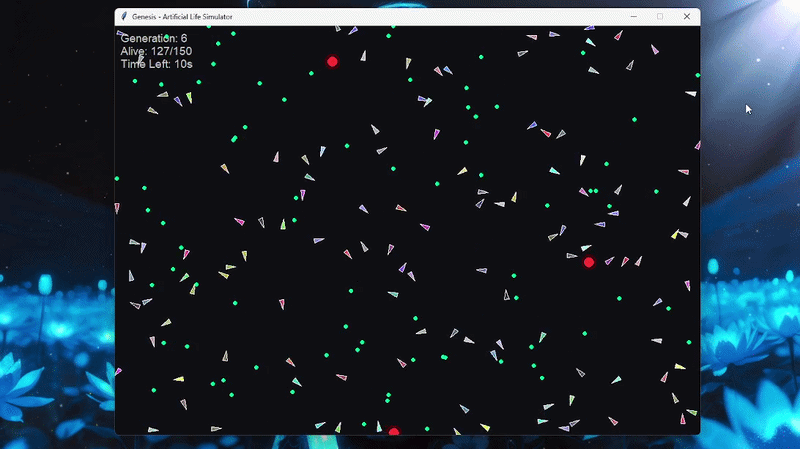

# Simulation Preview




# NeuroGenesis 🧠⚡

### Artificial Life Simulator powered by Evolution & Genetic Algorithms

**NeuroGenesis** is an experimental Artificial Life simulation where autonomous agents evolve over generations using **Genetic Algorithms** and **neural decision-making**.

In this simulation, intelligent entities (Boids) learn to survive in a dynamic environment by searching for food, avoiding predators, and adapting their behavior over time.

The system demonstrates how **complex behaviors can emerge from simple evolutionary rules**.

---

# 🧬 Core Idea

NeuroGenesis simulates a digital ecosystem where:

* Agents search for food to survive
* Predators hunt them
* Each agent has a small “brain” controlling decisions
* The fittest agents pass their genes to the next generation

Over time, the population evolves and becomes better at survival.

Every Generation gets a time of 15 seconds to evolve and collect data.

This project explores the fascinating concept of **Artificial Life and Emergent Intelligence**.

---

# ⚙️ Features

✅ Artificial life simulation
✅ Evolution through genetic algorithms
✅ Autonomous AI agents
✅ Predator–prey ecosystem
✅ Real-time visualization using Tkinter
✅ Population evolution over generations
✅ Dynamic environment

---

# 🧠 Technologies Used

* Python
* Tkinter (visual simulation)
* Genetic Algorithms
* Evolutionary computation
* Artificial Life systems
* Swarm intelligence concepts


# ▶️ How to Run

### 1️⃣ Clone the repository

```
git clone https://github.com/KeepONCoding2009/Genesis---Artificial-Life-Simulator.git
```

### 2️⃣ Go to the project folder

```
cd Genesis---Artificial-Life-Simulator
```

### 3️⃣ Run the simulator

```
python main.py
```

The Artificial Life simulation window will open and evolution will begin automatically.

---

# 🔬 What You Will See

* A population of agents moving in the environment
* Green dots representing food
* Red predators hunting the agents
* Agents learning to survive across generations

Over time, you may observe **more intelligent survival strategies emerging**.

---

# 🚀 Future Improvements

Possible upgrades for the project:

* Neural network based brains
* Reinforcement learning agents
* GPU accelerated simulation
* Larger ecosystems
* Real-time statistics & graphs
* 3D visualization
* Multi-species evolution

---

# 📚 Inspiration

This project is inspired by concepts from:

* Artificial Life research
* Evolutionary algorithms
* Swarm intelligence
* Emergent behavior in complex systems

---

# 👨‍💻 Author

Developed by **Ahnaf Islam Swapnil(Bismuth)**

Portfolio :- https://swpnil.me/
Backup Domain :- https://ahnafislamswapnil.netlify.app/

---

# ⭐ If you like this project

Give the repository a **star ⭐** and feel free to experiment with the simulation!
